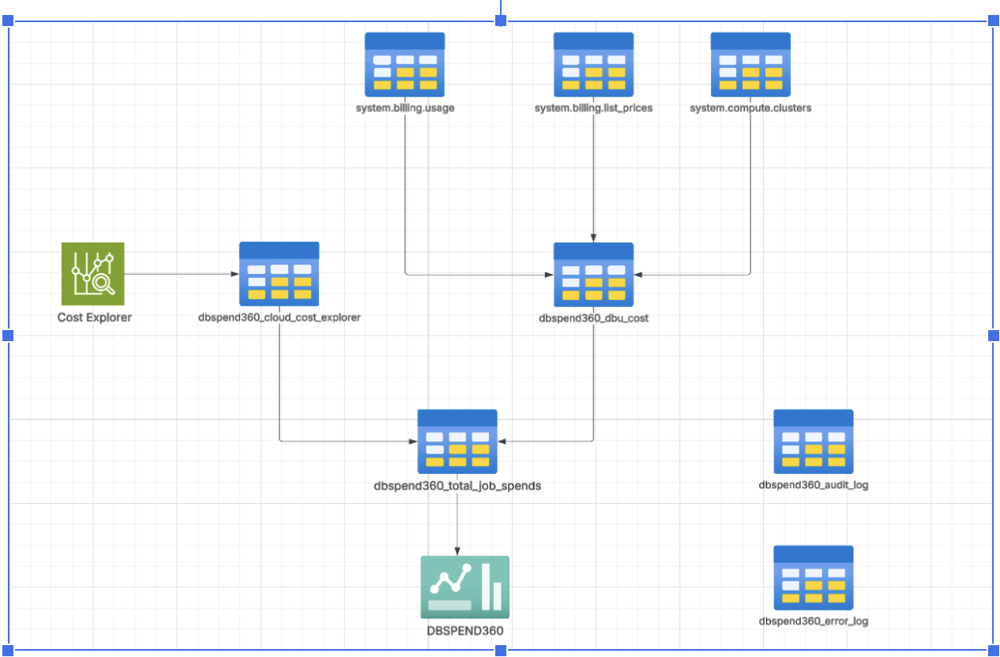
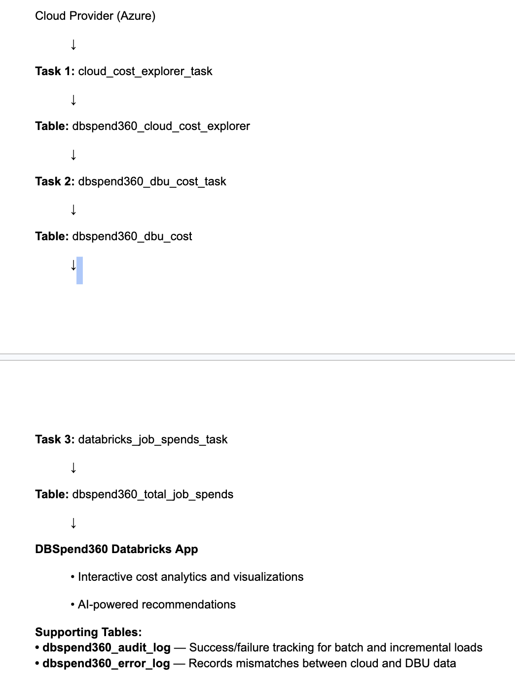
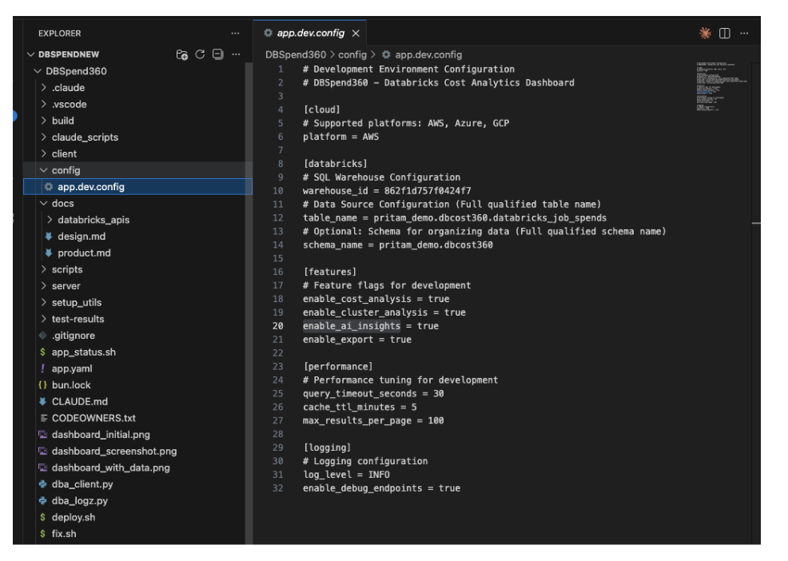
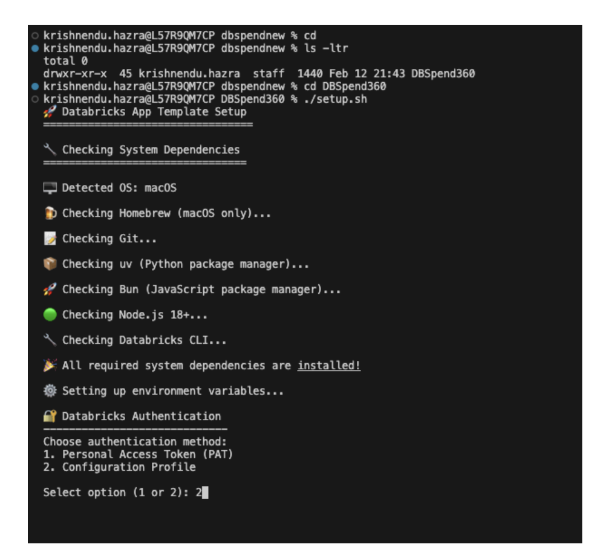
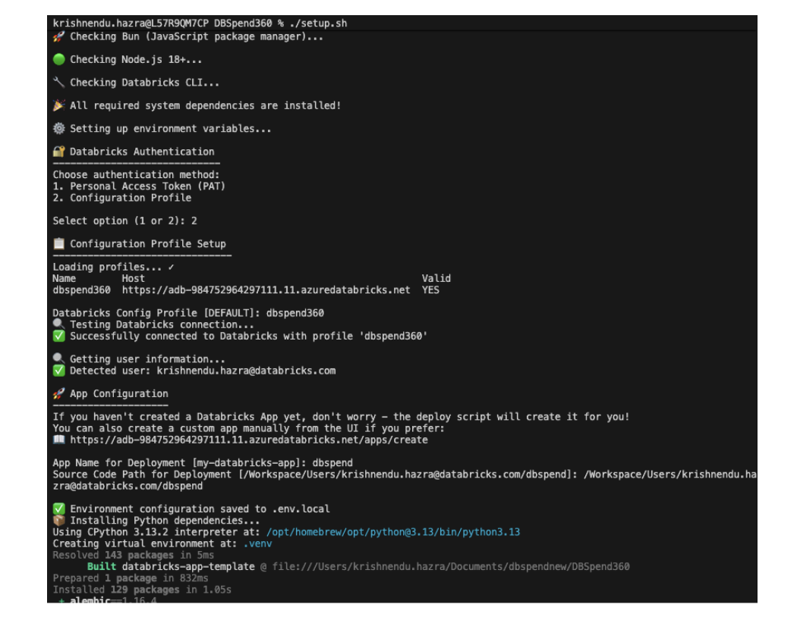
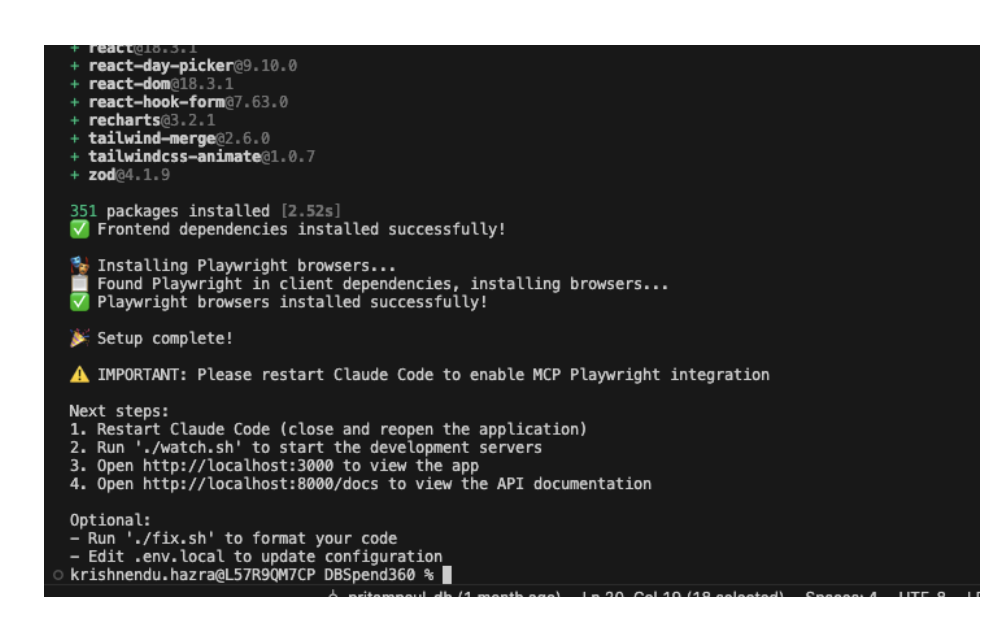
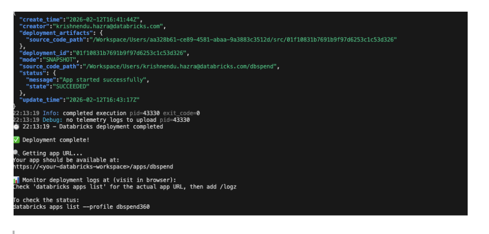
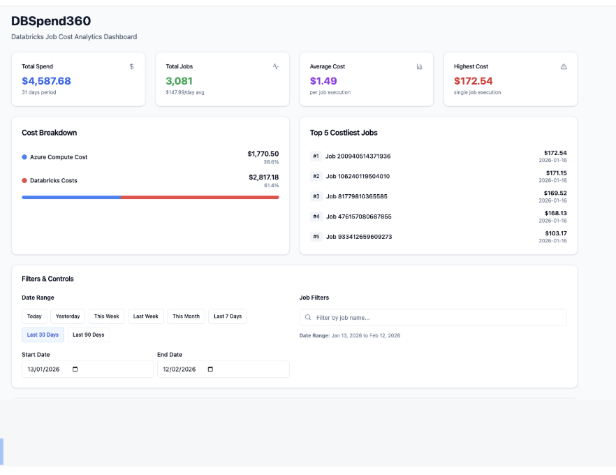
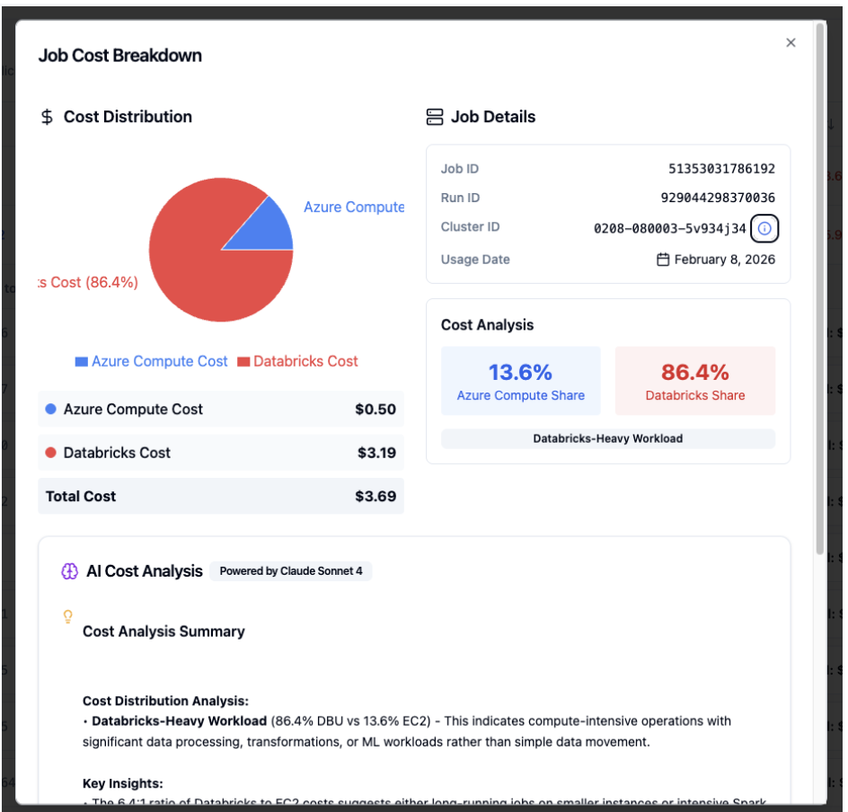

----
DBSPEND360
----

1. Overview

* DBSPEND360 is a Databricks-native solution that provides clear job-level visibility into cloud and DBU spends for Databricks workloads on Azure.

* Tracks end-to-end cost at job, run, and cluster level for Databricks jobs.
* Combines cloud VM cost from the cloud cost explorer with Databricks DBU cost from system billing tables.
* Produces a consolidated dbspend360_total_job_spends table as the single source of truth for job-level cost.
* Includes audit and error logging to support incremental loads, monitoring, and reconciliation.
* Powers the DBSPEND360 Databricks App, which provides dashboards and AI-driven cost and performance recommendations.

 
 

2. Architecture

## Logical Architecture Diagram

## Implementation Flow

3. Usage 

* Download the DBSPEND360 databricks app repo from https://github.com/pritampaul-db/DBSpend360.

* Jobs folder contains all the DDL, Notebooks , and resource template for DBSPEND360 Job.
* release folder contains the product release doc and the azure SPN setup guide needed for the data ingestion from cost explorer.
* readme.md contains all the usage related description as mentioned below:

    1. Setup your local databrickscfg file with DATABRICKS_HOST and DATABRICKS_TOKEN details. 
    2. Update config file from config-> app.dev.config , this will be used to deploy the app.

#### Step by step setup:

* Change directory to DBSpend360 in your cloned git golder using 
* cd DBSpend360
* In the config folder change the values in  app.dev.config for:
    1. Warehouse_id
    2. Table_name (catalog.schema.table)
    3. Schema_name (catalog.schema)

* Run setup.sh and follow the below steps:

  1. Choose the Authentication type
  2. Choose the databricks configuration profile you want to use to deploy the app
  3. Give an app name: App name should not have cap letters or numbers
  4. Give the source code path to store all the app related code/assets

* Run the deploy command : ./deploy.sh --verbose --create (This creates and deploys the app)

* App SPN should have below permissions:

  1. CAN USE for the sql warehouse mentioned in the app config file.
  2. USE CATALOG, USE SCHEMA, SELECT permissions on the catalog, schema, table name used for sourcing the data of the databricks app from dbspend360_total_job_spends.
  3. App uses databricks-claude-sonnet-4 as foundation model to generate insights for cost/performance improvements.

